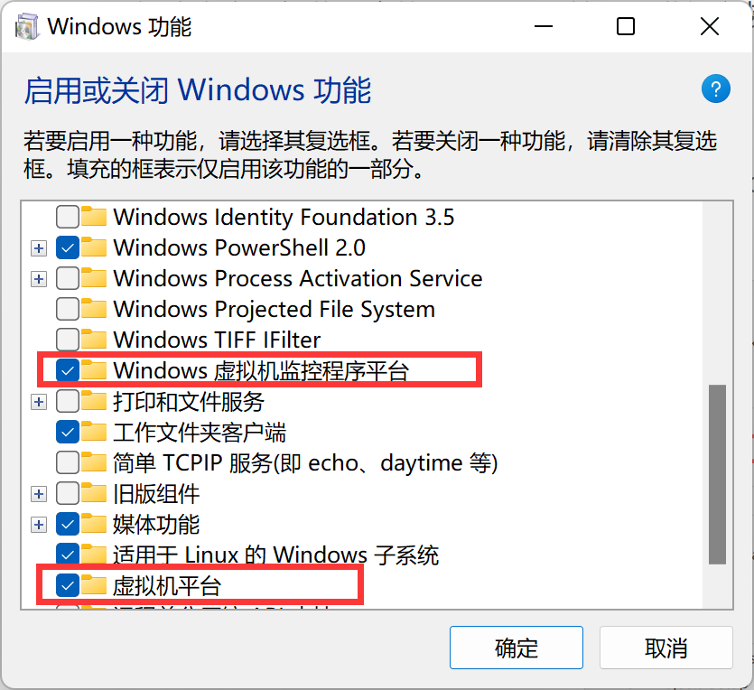
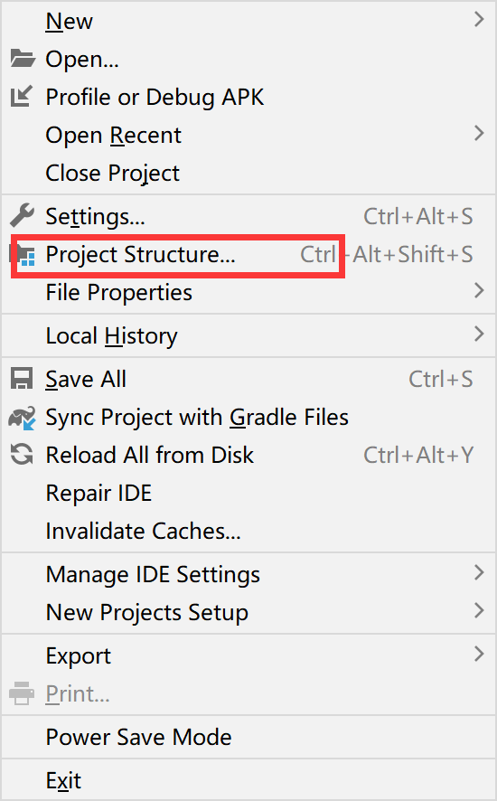
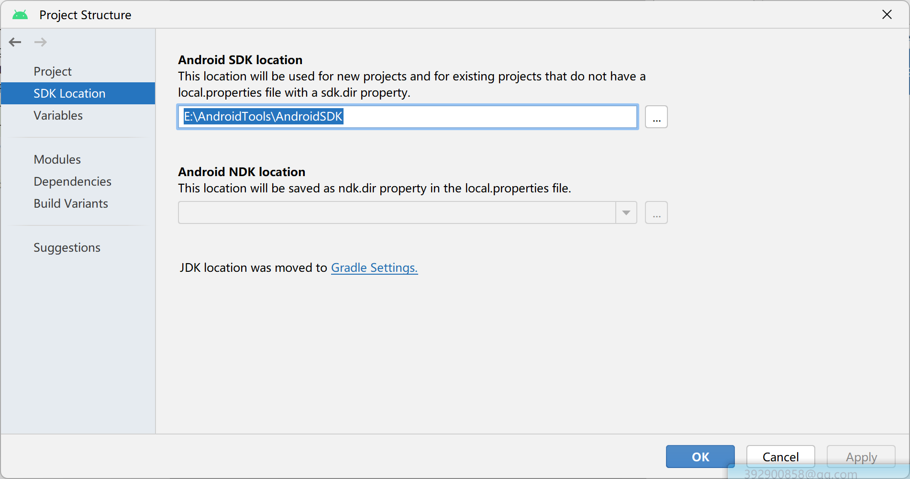
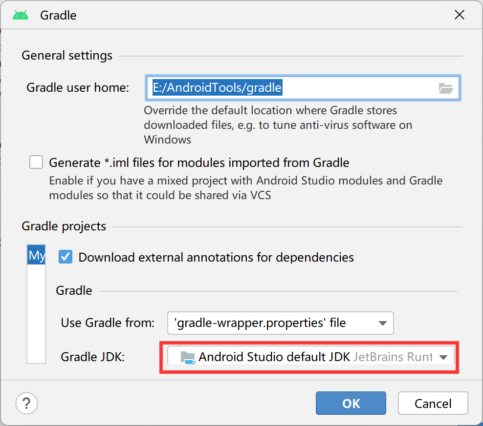
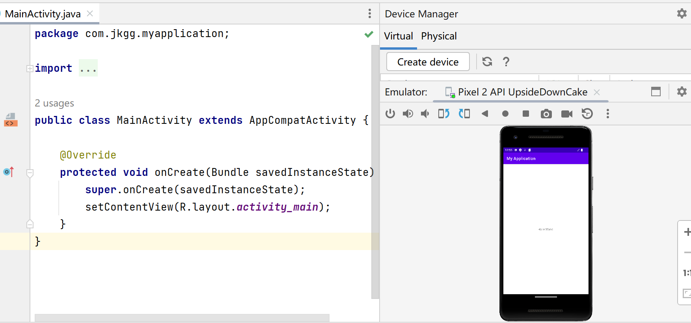
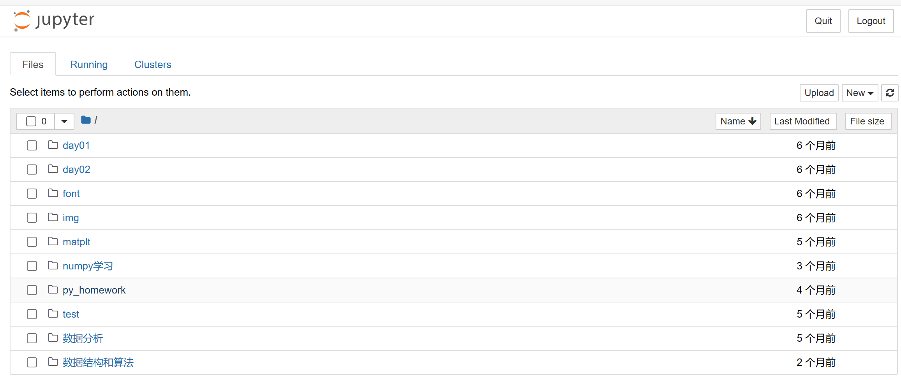
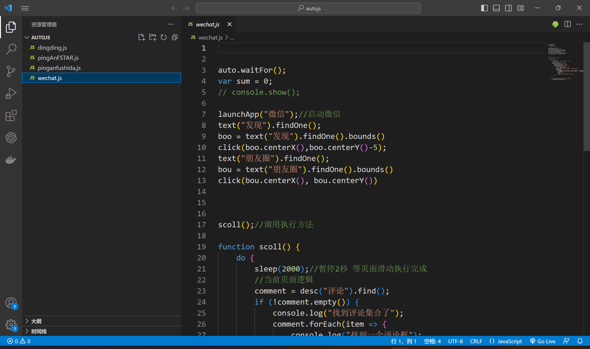

# 软件项目实践——实验1

## 任务1  安 装 Android Studio 4.1 之 上 的 版 本 ， 更 好 的 支 持TensorFlow Lite

+ 安装过程与一些问题
  + 安装软件
  
  + 安装SDK
  
  + 安装device
  
    + 出现的问题：
  
      1. 安装镜像的时候会报无法安装
  
         解决方案：卸载原来的intel x86，然后再进行安装，但是还会报错，接着打开Windows虚拟平台，成功解决
  
         
      
         
      
      2. 解决 Could not resolve com.android.tools.build:gradle:7.4.2
      
         原因：jdk版本为8可能太低了。
      
         
      
      
      
      将jdk版本改到11
      
      
      
      

+ 安装后运行截图

## 任务2  安装Jupyter Notebook和相关的Python环境，后续用于机器学习模型构建。

+ 程序运行截图

## 实验3   安装Visual Studio Code代码编辑器

+ 运行截图

