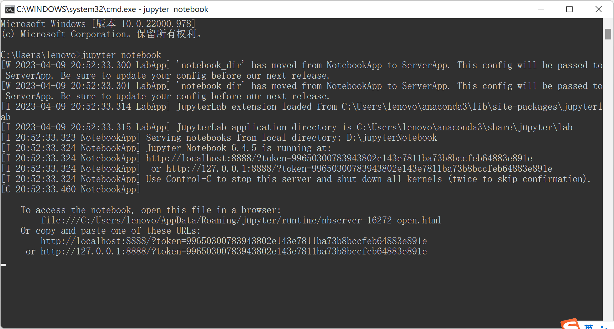

# 软件项目实践——实验1

## 任务1  安 装 Android Studio 4.1 之 上 的 版 本 ， 更 好 的 支 持TensorFlow Lite

+ 安装后运行截图

## 任务2  安装Jupyter Notebook和相关的Python环境，后续用于机器学习模型构建。

+ 程序运行截图

## 实验3   安装Visual Studio Code代码编辑器

+ 运行截图

