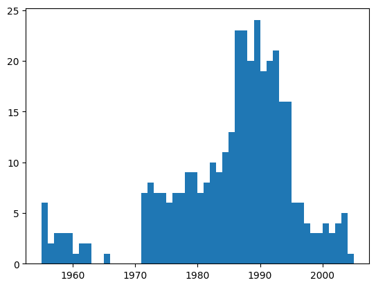
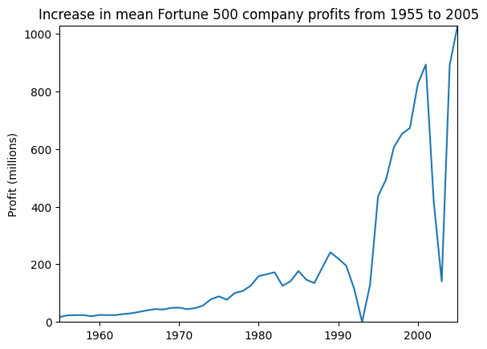
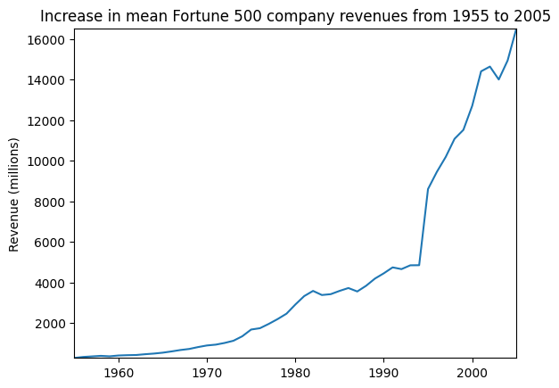

## 实验3 Jupyter Notebook实践

### Notebook基本概念

#### 熟悉Notebook的快捷键

1. 使用Ctrl + Shift + P命令可以查看所有Notebook支持的命令。

    在命名模式下，一些快捷键将十分有帮助
+ 上下键头可以上下cell移动
+ A 或者 B在上方或者下方插入一个cell
+ M 将转换活动cell为Markdown cell
+ Y 将设置活动cell为代码 cell
+ D+D（两次）删除cell
+ Z 撤销删除
+ H 打开所有快捷键的说明

在编辑模式，Ctrl + Shift + -将以光标处作为分割点，将cell一分为二。

#### 掌握Notebook中Cell的两种模式（Edit和Command）

有两种模式，编辑模式（edit mode）和命名模式（command mode）

+ 编辑模式：enter健切换，绿色轮廓
+ 命令模式：esc健切换，蓝色轮廓

#### 理解Notebook中Kernel的概念

每个notebook都基于一个内核运行，当执行cell代码时，代码将在内核当中运行，运行的结果会显示在页面上。Kernel中运行的状态在整个文档中是延续的，可以跨越所有的cell。这意思着在一个Notebook某个cell定义的函数或者变量等，在其他cell也可以使用。例如：


```python
import numpy as np
arr = np.arange(10)
arr
```


    array([0, 1, 2, 3, 4, 5, 6, 7, 8, 9])


```python
arr.reshape(2,5)
```


    array([[0, 1, 2, 3, 4],
           [5, 6, 7, 8, 9]])


注意：Restart Kernal将清空保存在内存中的变量。同时，在浏览器中关闭一个正在运行的notebook页面，并未真正关闭终止Kernel的运行，其还是后台执行。要真正关闭，可选择File > Close and Halt，或者Kernel > Shutdown。

### 熟悉基本的Python语法

#### 掌握Python基本语法并编写选择排序算法

+ 定义selection_sort函数执行选择排序功能。
+ 定义test函数进行测试，执行数据输入，并调用selection_sort函数进行排
序，最后输出结果。


```python
def selection_sort(array): 
    # 进行选择排序
    for i in range(0,len(array)):
        min = i
        for j in range(i+1,len(array)):
            if array[j] < array[min]:
                min = j
        if min != i:
            array[i],array[min] = array[min],arr[i]
           
def printArr(array):
    # 打印数组
    for item in array:
        print(item,end="")

```

测试：


```python
array = [1,2,7,3,6,9,5,8]
print("排序前:")
printArr(array)
selection_sort(array)
print()
print("排序后:")
printArr(array)
```

    排序前:
    12736958
    排序后:
    12325458

### 数据分析以及数据图形绘制


```python
%matplotlib inline
import pandas as pd
import matplotlib.pyplot as plt
import seaborn as sns
```

1. 读取数据集并显示相关属性


```python
data = pd.read_csv("fortune500.csv")
```

显示前5条数据


```python
data.head()
```


<div>
<style scoped>
    .dataframe tbody tr th:only-of-type {
        vertical-align: middle;
    }

    .dataframe tbody tr th {
        vertical-align: top;
    }

    .dataframe thead th {
        text-align: right;
    }
</style>
<table border="1" class="dataframe">
  <thead>
    <tr style="text-align: right;">
      <th></th>
      <th>Year</th>
      <th>Rank</th>
      <th>Company</th>
      <th>Revenue (in millions)</th>
      <th>Profit (in millions)</th>
    </tr>
  </thead>
  <tbody>
    <tr>
      <th>0</th>
      <td>1955</td>
      <td>1</td>
      <td>General Motors</td>
      <td>9823.5</td>
      <td>806</td>
    </tr>
    <tr>
      <th>1</th>
      <td>1955</td>
      <td>2</td>
      <td>Exxon Mobil</td>
      <td>5661.4</td>
      <td>584.8</td>
    </tr>
    <tr>
      <th>2</th>
      <td>1955</td>
      <td>3</td>
      <td>U.S. Steel</td>
      <td>3250.4</td>
      <td>195.4</td>
    </tr>
    <tr>
      <th>3</th>
      <td>1955</td>
      <td>4</td>
      <td>General Electric</td>
      <td>2959.1</td>
      <td>212.6</td>
    </tr>
    <tr>
      <th>4</th>
      <td>1955</td>
      <td>5</td>
      <td>Esmark</td>
      <td>2510.8</td>
      <td>19.1</td>
    </tr>
  </tbody>
</table>
</div>


显示最后5条记录


```python
data.tail()
```


<div>
<style scoped>
    .dataframe tbody tr th:only-of-type {
        vertical-align: middle;
    }

    .dataframe tbody tr th {
        vertical-align: top;
    }

    .dataframe thead th {
        text-align: right;
    }
</style>
<table border="1" class="dataframe">
  <thead>
    <tr style="text-align: right;">
      <th></th>
      <th>Year</th>
      <th>Rank</th>
      <th>Company</th>
      <th>Revenue (in millions)</th>
      <th>Profit (in millions)</th>
    </tr>
  </thead>
  <tbody>
    <tr>
      <th>25495</th>
      <td>2005</td>
      <td>496</td>
      <td>Wm. Wrigley Jr.</td>
      <td>3648.6</td>
      <td>493</td>
    </tr>
    <tr>
      <th>25496</th>
      <td>2005</td>
      <td>497</td>
      <td>Peabody Energy</td>
      <td>3631.6</td>
      <td>175.4</td>
    </tr>
    <tr>
      <th>25497</th>
      <td>2005</td>
      <td>498</td>
      <td>Wendy's International</td>
      <td>3630.4</td>
      <td>57.8</td>
    </tr>
    <tr>
      <th>25498</th>
      <td>2005</td>
      <td>499</td>
      <td>Kindred Healthcare</td>
      <td>3616.6</td>
      <td>70.6</td>
    </tr>
    <tr>
      <th>25499</th>
      <td>2005</td>
      <td>500</td>
      <td>Cincinnati Financial</td>
      <td>3614.0</td>
      <td>584</td>
    </tr>
  </tbody>
</table>
</div>


对列名进行重命名


```python
data.columns = ['year', 'rank', 'company', 'revenue', 'profit']
data.columns
```


    Index(['year', 'rank', 'company', 'revenue', 'profit'], dtype='object')


检查数据条目是否加载完整。


```python
len(data)
```


    25500


检查属性列的类型。


```python
data.dtypes
```


    year         int64
    rank         int64
    company     object
    revenue    float64
    profit      object
    dtype: object


2. 进行数据清洗

其他属性列都正常，但是对于profit属性，期望将数值改为float类型，但原数据集中可能存在空值或者异常值，利用正则表达式进行检查。


```python
non_numberic_profits = data.profit.str.contains('[^0-9.-]')
data.loc[non_numberic_profits].head()
```


<div>
<style scoped>
    .dataframe tbody tr th:only-of-type {
        vertical-align: middle;
    }

    .dataframe tbody tr th {
        vertical-align: top;
    }

    .dataframe thead th {
        text-align: right;
    }
</style>
<table border="1" class="dataframe">
  <thead>
    <tr style="text-align: right;">
      <th></th>
      <th>year</th>
      <th>rank</th>
      <th>company</th>
      <th>revenue</th>
      <th>profit</th>
    </tr>
  </thead>
  <tbody>
    <tr>
      <th>228</th>
      <td>1955</td>
      <td>229</td>
      <td>Norton</td>
      <td>135.0</td>
      <td>N.A.</td>
    </tr>
    <tr>
      <th>290</th>
      <td>1955</td>
      <td>291</td>
      <td>Schlitz Brewing</td>
      <td>100.0</td>
      <td>N.A.</td>
    </tr>
    <tr>
      <th>294</th>
      <td>1955</td>
      <td>295</td>
      <td>Pacific Vegetable Oil</td>
      <td>97.9</td>
      <td>N.A.</td>
    </tr>
    <tr>
      <th>296</th>
      <td>1955</td>
      <td>297</td>
      <td>Liebmann Breweries</td>
      <td>96.0</td>
      <td>N.A.</td>
    </tr>
    <tr>
      <th>352</th>
      <td>1955</td>
      <td>353</td>
      <td>Minneapolis-Moline</td>
      <td>77.4</td>
      <td>N.A.</td>
    </tr>
  </tbody>
</table>
</div>


统计缺失记录


```python
len(data.profit[non_numberic_profits])
```


    369


发现非数字的记录相对来说较少，使用直方图显示按照年份的分布情况


```python
bin_sizes, _, _ = plt.hist(data.year[non_numberic_profits], bins=range(1955, 2006))

```


    

    


删除非数字记录


```python
data = data.loc[~non_numberic_profits]
data.profit = data.profit.apply(pd.to_numeric) # 将数据类型转为float
```

再次检查条目


```python
len(data)
```


    25131


```python
data.dtypes
```


    year         int64
    rank         int64
    company     object
    revenue    float64
    profit     float64
    dtype: object


3. 使用matplotlib进行绘图

以年分组绘制平均利润和收入


```python
group_by_year = data.loc[:, ['year', 'revenue', 'profit']].groupby('year')
avgs = group_by_year.mean()
x = avgs.index
y1 = avgs.profit
def plot(x, y, ax, title, y_label):
    ax.set_title(title)
    ax.set_ylabel(y_label)
    ax.plot(x, y)
    ax.margins(x=0, y=0)

```

开始绘图


```python
fig, ax = plt.subplots()
plot(x, y1, ax, 'Increase in mean Fortune 500 company profits from 1955 to 2005', 'Profit (millions)')
```


    

    


收入曲线


```python
y2 = avgs.revenue
fig, ax = plt.subplots()
plot(x, y2, ax, 'Increase in mean Fortune 500 company revenues from 1955 to 2005', 'Revenue (millions)')
```


    

    


公司收入曲线并没有出现急剧下降，可能是由于财务会计的处理。对数据结果进行标准差处理。


```python
def plot_with_std(x, y, stds, ax, title, y_label):
    ax.fill_between(x, y - stds, y + stds, alpha=0.2)
    plot(x, y, ax, title, y_label)
fig, (ax1, ax2) = plt.subplots(ncols=2)
title = 'Increase in mean and std Fortune 500 company %s from 1955 to 2005'
stds1 = group_by_year.std().profit.values
stds2 = group_by_year.std().revenue.values
plot_with_std(x, y1.values, stds1, ax1, title % 'profits', 'Profit (millions)')
plot_with_std(x, y2.values, stds2, ax2, title % 'revenues', 'Revenue (millions)')
fig.set_size_inches(14, 4)
fig.tight_layout()

```


    

    


