# 实验4 实现基本的图像分类APP

## 导入新的项目

+ 使用git命令下载项目源码

```
git clone https://github.com/hoitab/TFLClassify.git
```

+ 使用AndroidStudio打开项目

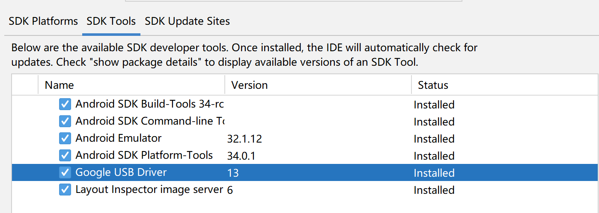

其中start模块是我们要完成的项目

## 完成相关配置与代码实现

### 向start模块中加入TensorFlow Lite Model

+ 右键“start”模块，或者选择File，然后New>Other>TensorFlow Lite Model（这里选择start模块，因为file中已经有完成后的项目模块finish，所以无法导入）

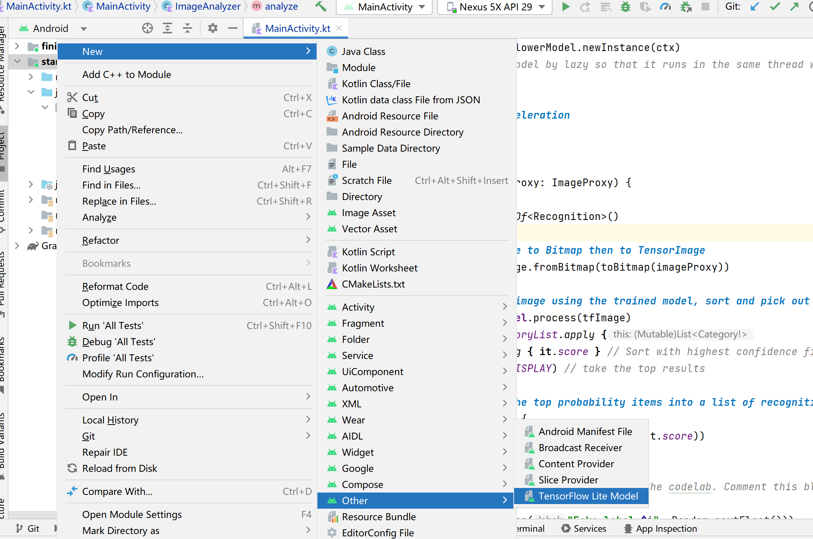


+ 选择已经下载的自定义的训练模型。这里选择finish模块中ml文件下的FlowerModel.tflite。

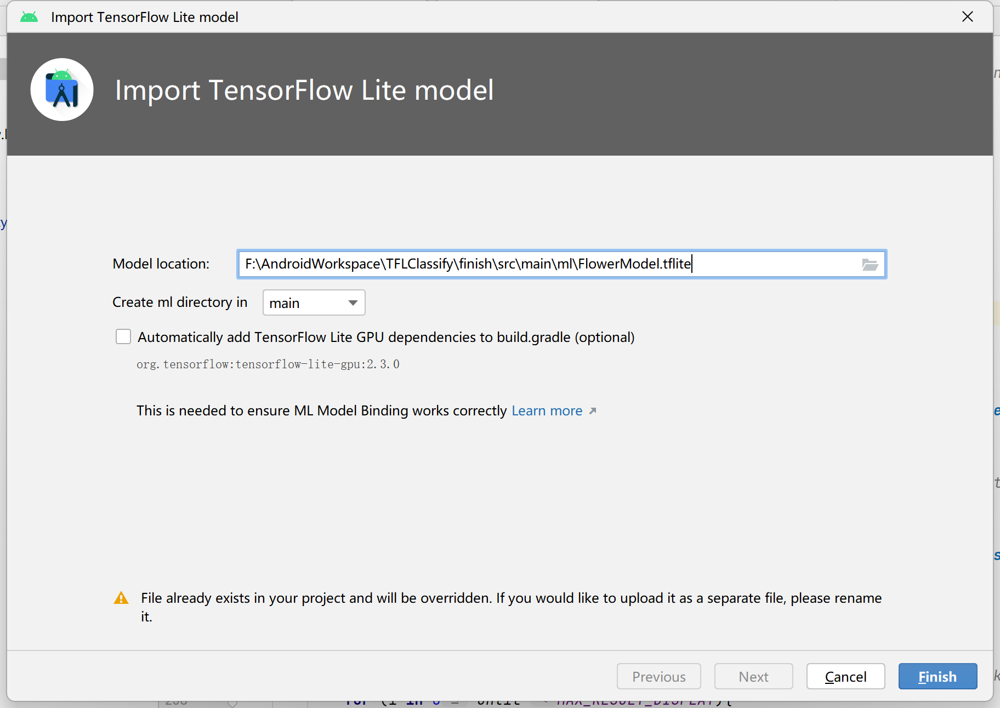


+ 最终TensorFlow Lite模型被成功导入，并生成摘要信息，如下图

​	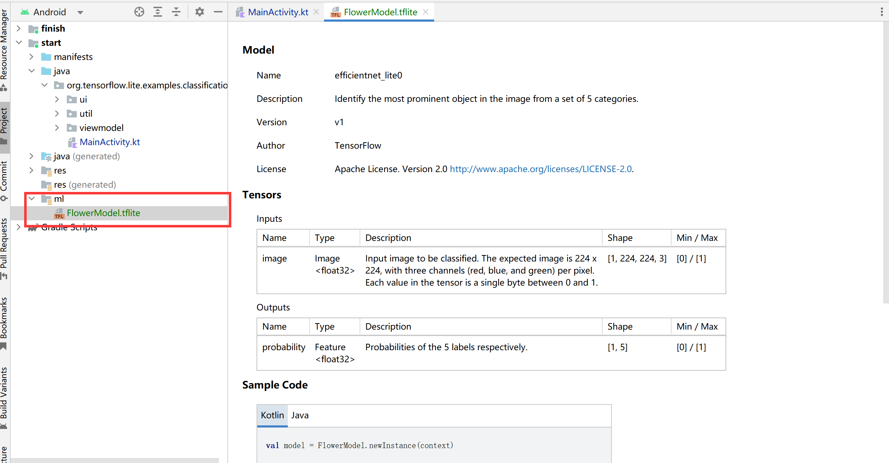


### 检查项目中的TODO项，添加相关代码

+ 检查TODO项

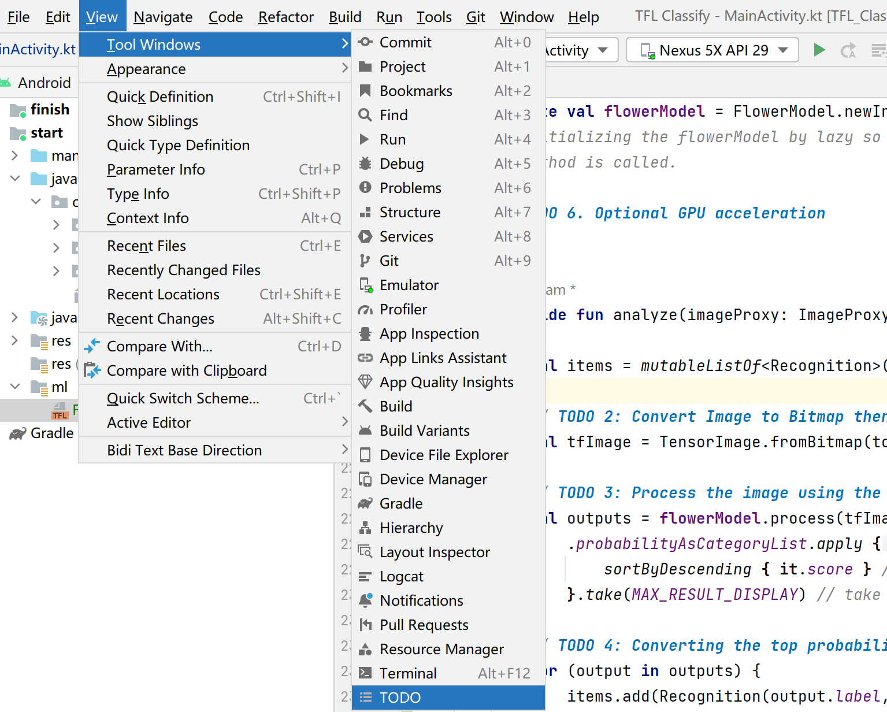

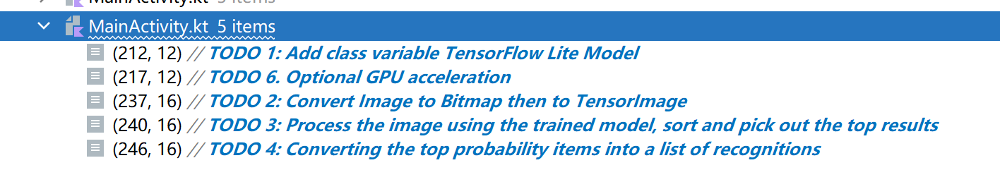

+ 向每个TODO中加入相关代码

  + TODO1

  ```java
  // TODO 1: Add class variable TensorFlow Lite Model
  private val flowerModel = FlowerModel.newInstance(ctx)
  ```

  + TODO2

  ```java
  // TODO 2: Convert Image to Bitmap then to TensorImage
              val tfImage = TensorImage.fromBitmap(toBitmap(imageProxy))
  ```

  + TODO3

  ```JAVA
   val outputs = flowerModel.process(tfImage)
                  .probabilityAsCategoryList.apply {
                      sortByDescending { it.score } // Sort with highest confidence first
                  }.take(MAX_RESULT_DISPLAY) // take the top results
  ```

  + TODO4

  ```JAVA
  // TODO 4: Converting the top probability items into a list of recognitions
  for (output in outputs) {
                  items.add(Recognition(output.label, output.score))
              }
  ```

  + TODO6

  ```JAVA
  // TODO 6. Optional GPU acceleration
  val compatList = CompatibilityList()
  
          val options = if(compatList.isDelegateSupportedOnThisDevice) {
              Log.d(TAG, "This device is GPU Compatible ")
              Model.Options.Builder().setDevice(Model.Device.GPU).build()
          } else {
              Log.d(TAG, "This device is GPU Incompatible ")
              Model.Options.Builder().setNumThreads(4).build()
          }
  ```

+ 重新运行项目

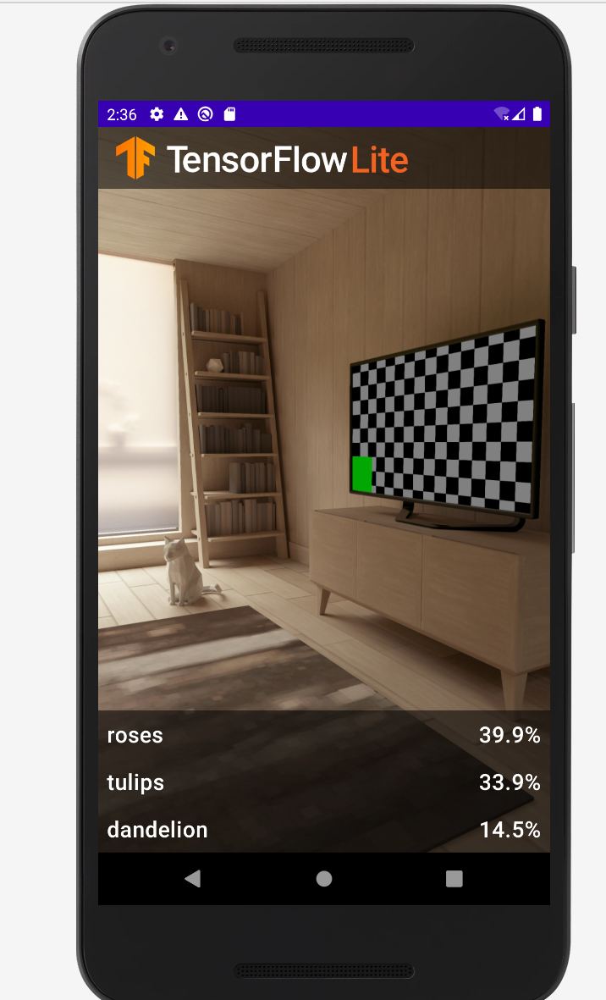


## 连接真机运行

### 连接真机

#### USB连接

+ 在SDK Tools中下载Google USB Driver


+ 打开手机的USB调试，然后将电脑设备驱动位置设在刚刚下载的driver的路径

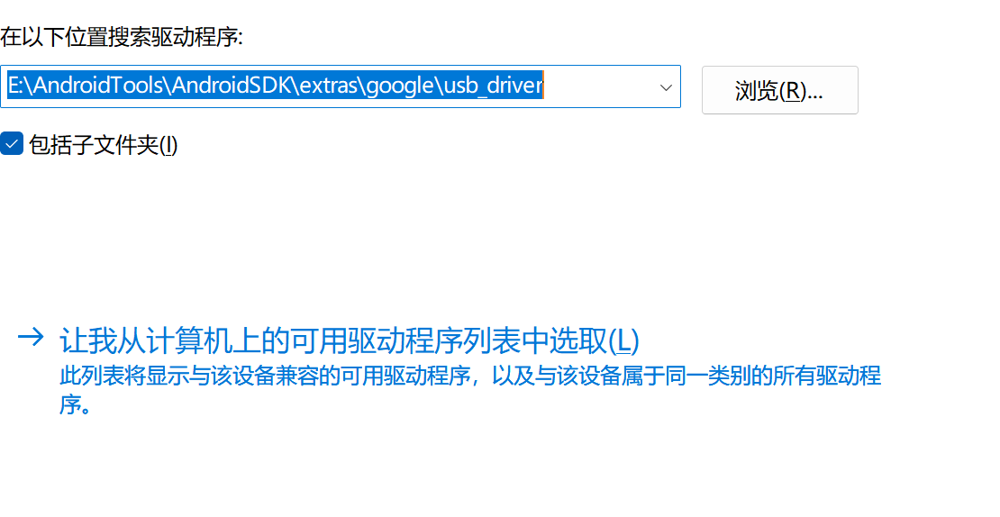

+ 在Troubleshoot Device Connections中加入刚刚的device，开启你的adb调试吧

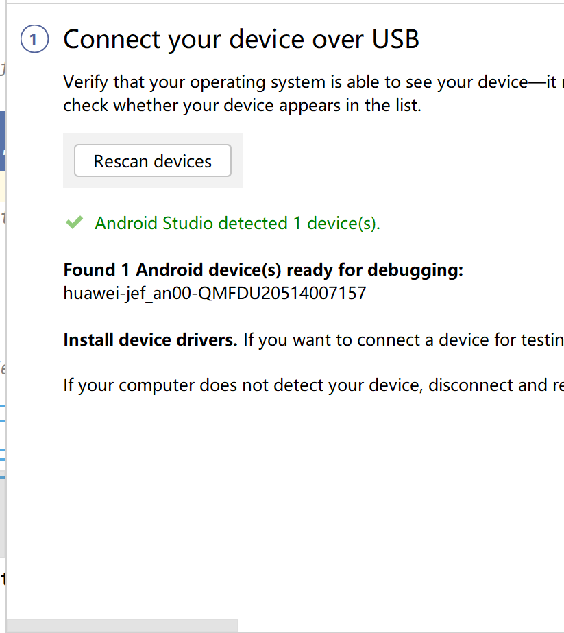


#### 无线调试

+ 确保手机电脑在一个局域网内

+ 手机是Android11以上版本

+ 扫码或者使用adb调试命令连接，这里展示adb连接

  +  将adb所在文件夹添加到path或者直接cd到该文件夹执行以下命令

  ```
  adb connect ip:端口
  ```

  

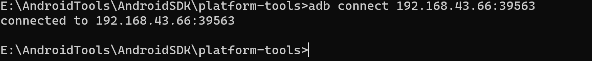

### 修改代码


将原先用于虚拟显示识别结果的代码注释掉或者删除

```java
// START - Placeholder code at the start of the codelab. Comment this block of code out.
            //没用了，否则会多显示3行
            for (i in 0 until MAX_RESULT_DISPLAY){
                items.add(Recognition("Fake label $i", Random.nextFloat()))
            }
// END - Placeholder code at the start of the codelab. Comment this block of code out.

```

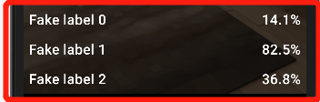

### 最终效果

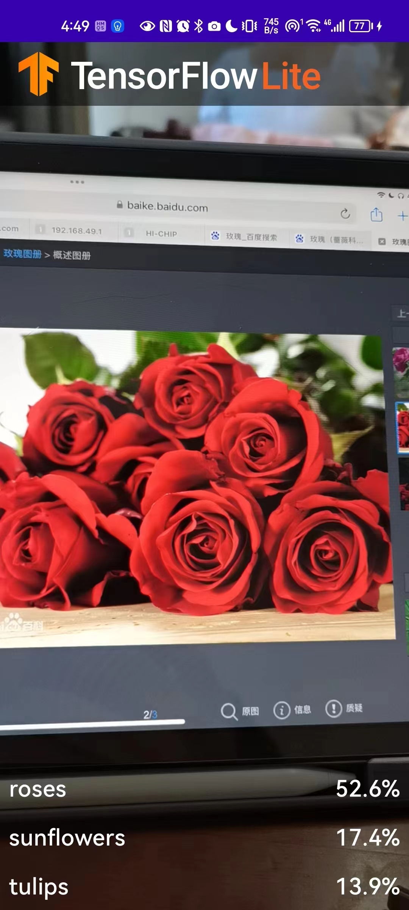

