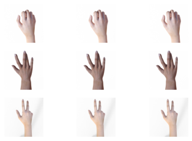
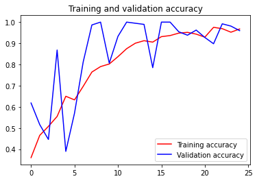

# 实验5_2TensorFlow 石头剪刀布模型生成

## 下载训练集和测试集,这里采用浏览器下载(图片)

## 解压数据集，并打印相关信息

解压文件


```python
import os
import zipfile

local_zip = 'F:/AndroidWorkspace/experience_5/game/rps.zip'
zip_ref = zipfile.ZipFile(local_zip, 'r')
zip_ref.extractall('./mldownload/')
zip_ref.close()

local_zip = 'F:/AndroidWorkspace/experience_5/game/rps-test-set.zip'
zip_ref = zipfile.ZipFile(local_zip, 'r')
zip_ref.extractall('./mldownload/')
zip_ref.close()

```

检测结果打印相关信息


```python
rock_dir = os.path.join('./mldownload/rps/rock')
paper_dir = os.path.join('./mldownload/rps/paper')
scissors_dir = os.path.join('./mldownload/rps/scissors')

print('total training rock images:', len(os.listdir(rock_dir)))
print('total training paper images:', len(os.listdir(paper_dir)))
print('total training scissors images:', len(os.listdir(scissors_dir)))

rock_files = os.listdir(rock_dir)
print(rock_files[:10])

paper_files = os.listdir(paper_dir)
print(paper_files[:10])

scissors_files = os.listdir(scissors_dir)
print(scissors_files[:10])
```

    total training rock images: 840
    total training paper images: 840
    total training scissors images: 840
    ['rock01-000.png', 'rock01-001.png', 'rock01-002.png', 'rock01-003.png', 'rock01-004.png', 'rock01-005.png', 'rock01-006.png', 'rock01-007.png', 'rock01-008.png', 'rock01-009.png']
    ['paper01-000.png', 'paper01-001.png', 'paper01-002.png', 'paper01-003.png', 'paper01-004.png', 'paper01-005.png', 'paper01-006.png', 'paper01-007.png', 'paper01-008.png', 'paper01-009.png']
    ['scissors01-000.png', 'scissors01-001.png', 'scissors01-002.png', 'scissors01-003.png', 'scissors01-004.png', 'scissors01-005.png', 'scissors01-006.png', 'scissors01-007.png', 'scissors01-008.png', 'scissors01-009.png']


各打印3张训练集的照片


```python
%matplotlib inline

import matplotlib.pyplot as plt
import matplotlib.image as mpimg

pic_index = 3

next_rock = [os.path.join(rock_dir, fname) 
                for fname in rock_files[pic_index-3:pic_index]]
next_paper = [os.path.join(paper_dir, fname) 
                for fname in paper_files[pic_index-3:pic_index]]
next_scissors = [os.path.join(scissors_dir, fname) 
                for fname in scissors_files[pic_index-3:pic_index]]
# 创建一个包含3*3的子图的图形窗口,fig中存储着这些信息
fig, axes = plt.subplots(nrows=3, ncols=3)
print(fig.get_figure,axes)
img_paths = []
img_paths.append(next_rock)
img_paths.append(next_paper)
img_paths.append(next_scissors)
for i, axs in enumerate(axes):
    print 
    for j,ax in enumerate(axs):
        img = mpimg.imread(img_paths[i][j]) # 用于读取图像文件并返回一个表示图像的 NumPy 数组,并不会显示图像
        ax.imshow(img)
        ax.axis('Off') # 关闭坐标轴显示
plt.show()

```

    <bound method Artist.get_figure of <Figure size 432x288 with 9 Axes>> [[<AxesSubplot:> <AxesSubplot:> <AxesSubplot:>]
     [<AxesSubplot:> <AxesSubplot:> <AxesSubplot:>]
     [<AxesSubplot:> <AxesSubplot:> <AxesSubplot:>]]



    


## 调用TensorFlow的keras进行数据模型的训练和评估。


```python
import tensorflow as tf
import keras_preprocessing
from keras_preprocessing import image
from keras_preprocessing.image import ImageDataGenerator

TRAINING_DIR = "./mldownload/rps/"
training_datagen = ImageDataGenerator(
      rescale = 1./255,   # 将图像的像素值缩放到 0 到 1 之间，以便归一化处理。
	    rotation_range=40,  # 随机旋转图像的角度范围为 -40 到 40 度。
      width_shift_range=0.2, # 随机水平平移图像的宽度比例范围为 -0.2 到 0.2。
      height_shift_range=0.2, # 随机垂直平移图像的高度比例范围为 -0.2 到 0.2。
      shear_range=0.2, # 随机错切变换图像的剪切强度范围为 -0.2 到 0.2。
      zoom_range=0.2, # 随机缩放图像的尺寸范围为 0.8 到 1.2。
      horizontal_flip=True, # 随机水平翻转图像。
      fill_mode='nearest') # 填充图像的像素采用最近邻插值。

VALIDATION_DIR = "./mldownload/rps-test-set/"
validation_datagen = ImageDataGenerator(rescale = 1./255)

# 使用生成的图像数据生成器对象来获取增强的图像样本，并将其用于模型的训练过程。
train_generator = training_datagen.flow_from_directory(
	TRAINING_DIR,
	target_size=(150,150),
	class_mode='categorical',
  batch_size=126
)

validation_generator = validation_datagen.flow_from_directory(
	VALIDATION_DIR,
	target_size=(150,150),
	class_mode='categorical',
  batch_size=126
)

model = tf.keras.models.Sequential([
    # Note the input shape is the desired size of the image 150x150 with 3 bytes color
    # This is the first convolution
    tf.keras.layers.Conv2D(64, (3,3), activation='relu', input_shape=(150, 150, 3)),
    tf.keras.layers.MaxPooling2D(2, 2),
    # The second convolution
    tf.keras.layers.Conv2D(64, (3,3), activation='relu'),
    tf.keras.layers.MaxPooling2D(2,2),
    # The third convolution
    tf.keras.layers.Conv2D(128, (3,3), activation='relu'),
    tf.keras.layers.MaxPooling2D(2,2),
    # The fourth convolution
    tf.keras.layers.Conv2D(128, (3,3), activation='relu'),
    tf.keras.layers.MaxPooling2D(2,2),
    # Flatten the results to feed into a DNN
    tf.keras.layers.Flatten(),
    tf.keras.layers.Dropout(0.5),
    # 512 neuron hidden layer
    tf.keras.layers.Dense(512, activation='relu'),
    tf.keras.layers.Dense(3, activation='softmax')
])


model.summary()

model.compile(loss = 'categorical_crossentropy', optimizer='rmsprop', metrics=['accuracy'])

history = model.fit(train_generator, epochs=25, steps_per_epoch=20, validation_data = validation_generator, verbose = 1, validation_steps=3)

model.save("rps.h5")

```

    Found 2520 images belonging to 3 classes.
    Found 372 images belonging to 3 classes.
    Model: "sequential"
    _________________________________________________________________
     Layer (type)                Output Shape              Param #   
    =================================================================
     conv2d (Conv2D)             (None, 148, 148, 64)      1792      
                                                                     
     max_pooling2d (MaxPooling2D  (None, 74, 74, 64)       0         
     )                                                               
                                                                     
     conv2d_1 (Conv2D)           (None, 72, 72, 64)        36928     
                                                                     
     max_pooling2d_1 (MaxPooling  (None, 36, 36, 64)       0         
     2D)                                                             
                                                                     
     conv2d_2 (Conv2D)           (None, 34, 34, 128)       73856     
                                                                     
     max_pooling2d_2 (MaxPooling  (None, 17, 17, 128)      0         
     2D)                                                             
                                                                     
     conv2d_3 (Conv2D)           (None, 15, 15, 128)       147584    
                                                                     
     max_pooling2d_3 (MaxPooling  (None, 7, 7, 128)        0         
     2D)                                                             
                                                                     
     flatten (Flatten)           (None, 6272)              0         
                                                                     
     dropout (Dropout)           (None, 6272)              0         
                                                                     
     dense (Dense)               (None, 512)               3211776   
                                                                     
     dense_1 (Dense)             (None, 3)                 1539      
                                                                     
    =================================================================
    Total params: 3,473,475
    Trainable params: 3,473,475
    Non-trainable params: 0
    _________________________________________________________________
    Epoch 1/25
    20/20 [==============================] - 88s 4s/step - loss: 1.5243 - accuracy: 0.3603 - val_loss: 1.0566 - val_accuracy: 0.6183
    Epoch 2/25
    20/20 [==============================] - 89s 4s/step - loss: 1.0638 - accuracy: 0.4655 - val_loss: 0.8602 - val_accuracy: 0.5161
    Epoch 3/25
    20/20 [==============================] - 85s 4s/step - loss: 1.3659 - accuracy: 0.5079 - val_loss: 0.9124 - val_accuracy: 0.4462
    Epoch 4/25
    20/20 [==============================] - 71s 3s/step - loss: 0.9051 - accuracy: 0.5548 - val_loss: 0.7275 - val_accuracy: 0.8683
    Epoch 5/25
    20/20 [==============================] - 89s 4s/step - loss: 0.7942 - accuracy: 0.6500 - val_loss: 1.4771 - val_accuracy: 0.3898
    Epoch 6/25
    20/20 [==============================] - 83s 4s/step - loss: 0.8136 - accuracy: 0.6329 - val_loss: 0.6804 - val_accuracy: 0.5699
    Epoch 7/25
    20/20 [==============================] - 73s 4s/step - loss: 0.7188 - accuracy: 0.6968 - val_loss: 0.5104 - val_accuracy: 0.8118
    Epoch 8/25
    20/20 [==============================] - 74s 4s/step - loss: 0.5557 - accuracy: 0.7643 - val_loss: 0.1753 - val_accuracy: 0.9866
    Epoch 9/25
    20/20 [==============================] - 79s 4s/step - loss: 0.5331 - accuracy: 0.7901 - val_loss: 0.0824 - val_accuracy: 1.0000
    Epoch 10/25
    20/20 [==============================] - 86s 4s/step - loss: 0.4596 - accuracy: 0.8024 - val_loss: 0.6512 - val_accuracy: 0.8065
    Epoch 11/25
    20/20 [==============================] - 83s 4s/step - loss: 0.4177 - accuracy: 0.8369 - val_loss: 0.1555 - val_accuracy: 0.9328
    Epoch 12/25
    20/20 [==============================] - 88s 4s/step - loss: 0.3059 - accuracy: 0.8746 - val_loss: 0.1670 - val_accuracy: 1.0000
    Epoch 13/25
    20/20 [==============================] - 72s 4s/step - loss: 0.2719 - accuracy: 0.9004 - val_loss: 0.0640 - val_accuracy: 0.9946
    Epoch 14/25
    20/20 [==============================] - 91s 4s/step - loss: 0.2297 - accuracy: 0.9123 - val_loss: 0.0605 - val_accuracy: 0.9892
    Epoch 15/25
    20/20 [==============================] - 85s 4s/step - loss: 0.3013 - accuracy: 0.9056 - val_loss: 0.3473 - val_accuracy: 0.7849
    Epoch 16/25
    20/20 [==============================] - 71s 3s/step - loss: 0.1865 - accuracy: 0.9313 - val_loss: 0.0237 - val_accuracy: 1.0000
    Epoch 17/25
    20/20 [==============================] - 70s 3s/step - loss: 0.1785 - accuracy: 0.9365 - val_loss: 0.0353 - val_accuracy: 1.0000
    Epoch 18/25
    20/20 [==============================] - 70s 3s/step - loss: 0.1439 - accuracy: 0.9480 - val_loss: 0.1971 - val_accuracy: 0.9543
    Epoch 19/25
    20/20 [==============================] - 71s 3s/step - loss: 0.1423 - accuracy: 0.9516 - val_loss: 0.1167 - val_accuracy: 0.9382
    Epoch 20/25
    20/20 [==============================] - 72s 4s/step - loss: 0.1509 - accuracy: 0.9433 - val_loss: 0.0725 - val_accuracy: 0.9624
    Epoch 21/25
    20/20 [==============================] - 72s 4s/step - loss: 0.2339 - accuracy: 0.9290 - val_loss: 0.0971 - val_accuracy: 0.9274
    Epoch 22/25
    20/20 [==============================] - 70s 3s/step - loss: 0.0753 - accuracy: 0.9754 - val_loss: 0.1865 - val_accuracy: 0.8978
    Epoch 23/25
    20/20 [==============================] - 71s 4s/step - loss: 0.0953 - accuracy: 0.9690 - val_loss: 0.0194 - val_accuracy: 0.9919
    Epoch 24/25
    20/20 [==============================] - 72s 4s/step - loss: 0.1206 - accuracy: 0.9524 - val_loss: 0.0667 - val_accuracy: 0.9812
    Epoch 25/25
    20/20 [==============================] - 70s 3s/step - loss: 0.0841 - accuracy: 0.9675 - val_loss: 0.0913 - val_accuracy: 0.9597


## 绘制训练和验证结果的相关信息


```python
import matplotlib.pyplot as plt
acc = history.history['accuracy']
val_acc = history.history['val_accuracy']
loss = history.history['loss']
val_loss = history.history['val_loss']

epochs = range(len(acc))

plt.plot(epochs, acc, 'r', label='Training accuracy')
plt.plot(epochs, val_acc, 'b', label='Validation accuracy')
plt.title('Training and validation accuracy')
plt.legend(loc=0)
plt.figure()
plt.show()
```


​    

​    


    <Figure size 432x288 with 0 Axes>


## 关于卷积和池化


1. **卷积（Convolution）**：
卷积是一种用于处理图像和其他多维数据的操作。它在神经网络中广泛应用于图像处理任务。卷积操作通过滑动一个卷积核（也称为过滤器）在输入数据上，计算输入数据与卷积核之间的乘积和加和。卷积核的参数在训练过程中学习得到。通过卷积操作，网络可以提取输入数据的局部特征，形成特征图。

卷积操作具有以下特点：
- 局部连接：卷积操作只考虑输入数据的局部区域，而不是整个输入数据。
- 参数共享：卷积核在整个输入数据上共享参数，这使得网络具有更少的参数量。
- 平移不变性：卷积操作对平移不变，即无论输入数据中的特征在图像中的位置如何变化，都能够识别相同的特征。

在卷积神经网络中，卷积操作通常用于提取图像的空间特征，例如边缘、纹理等。

2. **池化（Pooling）**：
池化是一种用于减小特征图尺寸的操作。它在神经网络中通常紧跟在卷积层之后。池化操作通过在输入数据的局部区域中选择最大值（最大池化）或平均值（平均池化）来降低特征图的尺寸。池化操作具有以下作用：
- **降低维度**：通过降低特征图的尺寸，减少了后续层中的参数量和计算量。
- 提取主要特征：通过选择局部区域的最大值或平均值，提取输入数据的主要特征。

池化操作通常不改变特征图的通道数，而只改变特征图的空间尺寸。常用的池化操作包括最大池化（Max Pooling）和平均池化（Average Pooling）。

在卷积神经网络中，池化操作通常用于逐步减小特征图的尺寸，并保留主要特征，以减少计算负担并提取更具鲁棒性的特征。

这就是卷积和池化这两个常用的神经网络操作的基本概念和作用。它们在卷积神经网络中起着重要的作用，帮助网络提取和学

